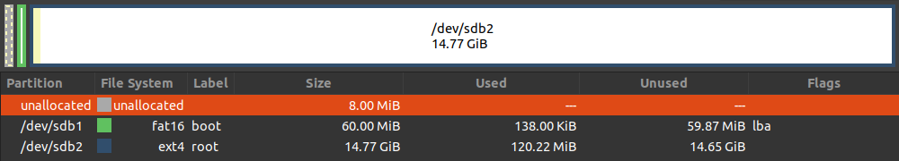

# Debian Writer for i.MX8

## SD Card Layout

The SD Card must have two partitions which are a small VFAT file system for Linux
Kernel image and its device tree files, and the second is an ext4 partition for the
root file system. Check how the layout must be:



### Formatting SD Card

1. Insert the SD Card into a SD Card reader/writer in a host PC running GNU/Linux
and use `lsblk` to find your SD Card device ID:
```console
$ lsblk
```

2. Create the two partitions using parted(8). Replace `/dev/sd<x>` in the
instructions below with the correct device output from previous command:
```console
# parted /dev/sd<x>
```
  * Within the parted(8) user interface, run the following commands:
  ```bash
  mklabel msdos
  mkpart primary fat32 8MiB 68MiB
  mkpart primary ext4 68MiB -1
  quit
  ```
  * Create the file systems on the newly created partitions:
  ```console
  # mkfs -t vfat -n boot /dev/sd<x>1
  # mkfs -t ext4 -L root /dev/sd<x>2
  ```

## U-Boot

Booting i.MX 8 is a little trickier than previous i.MX SoCs. U-Boot is combined
with several other components and it is offset 33 KiB from the start of media
instead of 1 KiB. That offset pushes U-Boot's stored environment space further
out too requiring the first partition to start at 8 MiB instead of the 4 MiB I
use above. Please see [Build and Install U-Boot on i.MX8][community-doc] for
detailed information.

```console
# dd if=flash.bin of=/dev/sd<x> bs=1K seek=32 status=progress && sync
```

## Linux Kernel

To build the Linux Kernel, clone the repo from [CAF][linux-imx]:

```console
$ git clone https://source.codeaurora.org/external/imx/linux-imx/ && cd linux-imx/
```

1. Install and export the environment variables to cross compile the Kernel:
```console
# apt install gcc-aarch64-linux-gnu g++-aarch64-linux-gnu
$ export ARCH=arm64
$ export CROSS_COMPILE=/usr/bin/aarch64-linux-gnu-
```
2. Compile the Linux Kernel for the i.MX8 in general:
```console
$ make imx_v8_defconfig
$ make -j$(nproc)
```
  **NOTE**: There is one caveat to building the Linux kernel on distributions like Debian 8
  and newer that use the _systemd_. You must configure your kernel with:
  * **CONFIG_FHANDLE=y**
    * "General setup → open by fhandle syscalls" in menuconfig.

  Your Debian system will fail to come up in multi-user mode without _systemd_.
  Later NXP BSPs enable this feature **by default**.
3. Copy the Linux Kernel and device tree blob files to the first partition on
the SD Card:
  * Mount the device
  ```console
  # mount /dev/sd<x>1 /mnt
  ```
  * Consider copying only the .dtb files for the specific board (_e.g., imx8mp-evk*.dtb_)
  rather than all of them:
  ```console
  $ cp arch/arm64/boot/Image /mnt && sync
  $ cp arch/arm64/boot/dts/freescale/imx*.dtb /mnt && sync
  ```
  * Umount the device:
  ```console
  # umount /mnt
  ```

## Debian First Stage

Installation of the Debian root file system is performed in two stages. The first
stage is performed on the host PC with an Internet connection. It creates a
rudimentary directory layout and downloads package files to be installed during
the second stage.

1. Mount the second partition with the ext4 file system and run the debootstrap(2)
command on it:
```console
# mount /dev/sd<x>2 /mnt
# debootstrap --foreign --arch arm64 buster /mnt http://ftp.us.debian.org/debian
```
 * **Kernel Modules**
    * Install the Linux Kernel Modules and Firmware:
    ```console
    $ mkdir foo
    $ cd linux-imx/
    $ make modules_install firmware_install INSTALL_MOD_PATH=$HOME/foo
    # rsync -avHP $HOME/foo/lib/ /mnt
    ```

2. Umount the device:
```console
# umount /mnt
```

## Debian Second Stage

The second stage install is performed on the board running Linux on the root file
system created and populated previously.

1. Power on the board and quickly type a space in the terminal emulator to stop
the countdown to automatic boot.
2. Enter the following lines:
```console
env default -a
setenv bootdelay 3
setenv mmcargs "${mmcargs}" '${video} ${extraargs}'
setenv ethaddr
saveenv
reset
```
3. For the second stage install, configure the kernel to boot into a very simple
single-user environment running only a single shell then boot Linux. Because
this change is not saved to the U-Boot environment, it only applies to this boot.
```console
setenv extraargs init=/bin/bash
boot
```
4. Linux boots. Perform the second stage debootstrap(8) when the shell prompt appears.
```console
# export PATH
# ./debootstrap/debootstrap --second-stage
```

### Minor Configuration

Perform some minor configuration necessary when using debootstrap(8).

1. Change the hostname:
```console
# vi /etc/hostname
```
2. Populate the empty `/etc/apt/sources.list` with Debian repositories:
```console
deb http://deb.debian.org/debian buster main
deb-src http://deb.debian.org/debian buster main
deb http://deb.debian.org/debian buster-updates main
deb-src http://deb.debian.org/debian buster-updates main
deb http://security.debian.org/debian-security/ buster/updates main
deb-src http://security.debian.org/debian-security/ buster/updates main
```
3. Set the root password with the passwd(1) program or just delete the password
field for root in `/etc/passwd` and `/etc/shadow`:
```console
# passwd
```
4. Make certain your serial device name is present in `/etc/securetty`. The i.MX8
devices use `ttyLP0` for the serial console:
```console
# echo ttyLP0 >>/etc/securetty
```
5. Since systemd(8) is not running, the shutdown(8) and reboot(8) commands are
ineffective. Sync(1) the file systems manually, wait a moment for the file system
cache to finish flushing data to the SD Card and perform a hardware reset or
power-cycle the board. Allow U-Boot to boot normally.
```console
# sync
```

## Basic Debian Configuration

Linux should boot to a login: prompt after completing the second stage install
and rebooting. Log in as the root user using the password set above.

### Configure Ethernet

1. Plug in the (first) Ethernet port to a network.
2. Add the interface to `/etc/network/interfaces` with the following content.
```bash
auto eth0
iface eth0 inet dhcp
```
This assumes the IP address is configured with DHCP. It is possible to later
configure Ethernet networking via a GUI after installing one. For now, configure
the ifupdown tool in order to install Debian software packages from Internet repositories.

3. Bring up the Ethernet interface with the ifup(8) command configured above.
```console
# ifup eth0
# ip addr
```

### Set the Clock

Configure the time zone and set the clock using the network time protocol (NTP).

1. Follow the menus to select the appropriate time zone:
```console
dpkg-reconfigure tzdata
```

### Install Command Line Utilities

1. Install the following packages with `apt` tool:
```console
# apt update
```
  * **Convenience**
  ```console
  # apt install -y aptitude bind9-host bzip2 curl dnsutils file git htop less \
                   lshw mksh openssh-client openssh-server psmisc rsync screen \
                   sudo uptimed vim unzip wget cmake pkg-config
  ```
  * **Development**
  ```console
  # apt install -y bc build-essential gdb exuberant-ctags cscope
  ```

[community-doc]: https://community.nxp.com/docs/DOC-346854
[linux-imx]: https://source.codeaurora.org/external/imx/linux-imx/
